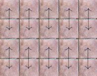
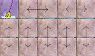

# No me pises lo fregao

El suelo mojado de mi chalet puede matar.

El juego: dos personas, 1 y 2. Al empezar, 1 elige una casilla y la friega. Después, 2 y 1, alternando turnos, friegan una casilla seca adyacente a la anterior. Si no puedes fregar en tu turno, pierdes porque la única forma de salir de ahí es pisando en mojado y resbalándote.

<!-- Board -->
<canvas id="board">
    No furula en este navegador.
</canvas>

<h3 id="turn"></h3>

<table style="">
    <tr>
        <td> <label>Filas</label> </td>
        <td> <input style="width: 3em" id="n_rows" type="number" min="1" max="10" value=3>  </td>
    </tr>
    <tr>
        <td> <label>Columnas</label> </td>
        <td> <input style="width: 3em" id="n_cols" type="number" min="1" max="10" value=4> </td>
    </tr>
    <tr>
        <td> <button type="button" onclick="generateBoard(); drawBoard();">Generar suelo</button>  </td>
    </tr>
</table>

Gracias a Issa por intentar resolver este juego. Gracias a Mario por sus sugerencias y por escucharme siempre, incluso cuando hablo de matemáticas que suele ser el 90% de las veces <small><small><small>pero solo dentro de un 10%</small></small></small>.

## ¿Quién gana?

Intenta averiguarlo. Puedes <u onclick="showSolution()">ver la solución</u> cuando quieras, pero hacerlo sin conocerla es reconocer que has perdido con la humillación que ello conlleva.

Más concretamente, si 1 y 2 jugasen perfecto, quién ganaría? Depende del tamaño del tablero. Empecemos por resolver un caso más sencillo, un tablero de 2 filas. Tras jugar 1, 2 puede jugar en la única otra casilla que se encuentra en la misma columna que la jugada anterior, es decir, si 1 juega en una casilla que está en la primera fila, 2 juega en la casilla que está justo debajo. De esta forma, a cada movimiento de 1 le corresponde un movimiento de 2, con lo que 2 ganará pues jugará en último lugar.

En otras palabras, hemos encontrado una regla de cómo jugar basada en separar las casillas en parejas de dos adyacentes, algo como "si 1 juega esta casilla, yo juego su pareja". En lenguaje matemático, hemos encontrado una partición del conjunto de casillas en la que cada clase tiene exactamente dos casillas, las cuales son adyacentes.

Generalicemos este razonamiento. Supongamos ahora que el tablero es de tamaño par, como en particular es el 2xn que acabamos de analizar. Esto es equivalente a decir que hay o bien una cantidad par de filas o una cantidad par de columnas (o ambas). Supongamos por ejemplo filas pares. Esto nos permite separar las casillas por parejas como en el 2xn, dando así la misma estrategia que hace ganar a 2: tras jugar 1 en una casilla, 2 juega en su pareja.

¿Qué ocurre si el número de casillas es impar? La respuesta es: 1 gana. Vamos a aprovechar lo que hemos razonado en los anteriores párrafos para justificar este hecho. Tenemos un tablero nxm con n y m impares y es el primer turno. 1 puede jugar en la esquina superior izquierda y separar (particionar) las casillas del siguiente modo: separamos la primera fila en parejas y el resto del tablero como antes (pues el resto es un tablero con cantidad par de filas).

Por ser n y m impares, el tablero siempre se podrá separar de esta forma. Tras el movimiento de 2, 1 juega en la pareja de la casilla que ha jugado 2. De esta forma, 1 se asegura jugar en último lugar y ganar.

Resumiendo, si el un número de casillas es par gana 2 y si es impar gana 1 ¿A qué mola? Notar que en ningún momento hemos recurrido a pensar cosas como "¿se fregaran todas las casillas?". Hemos conseguido una estrategia sencilla y elegante sin siquiera preocuparnos de cómo quedará el tablero al final. Te hace ganar y au. ¿Se podrá jugar a este juego en un tablero más general🤔?

Si has llegado hasta aquí, te doy las gracias ❤. Dale like y suscríbete.

## ¡Me gustan los grafos!

Este juego tiene una generalización directa a grafos (esto se pone matemático). Dado un grafo G, 1 empieza eligiendo un vértice cualquiera y lo friega. En lo sucesivo, 2 y 1 se alternan para fregar un vértice adyacente al anterior que no esté fregao. Pierdes si te quedas sin posibles vértices a fregar.

Lo que más me gusta de este juego es que la solución en grafos es bastante natural si conoces la solución en baldosas. ¡Veámoslo! Como esta es mi web voy a tomarme la libertad de llamar teorema a la siguiente proposición (y de no numerarlo jaja estoy loco).

<u>**Teorema:**</u> Dado un grafo G, 2 gana al juego de no pisar lo fregao si y solo si existe una partición de $V$, el conjunto de vértices de $G$, en parejas de vértices adyacentes.

<u>Demostración:</u> Si $V$ se puede particionar como dice el enunciado, 2 gana aplicando la misma estrategia explicada antes de generalizar el juego a grafos. Recíprocamente, supongamos que G no se puede particionar de esta forma. Considerar un subconjunto $V^\prime \subseteq V$ de tamaño máximo tal que $V^\prime$ sí que se puede particionar como en el enunciado. Fijamos dicha partición. La estrategia ganadora para 1 es como sigue: primero 1 juega en un vértice $u \notin V^\prime$. A cada jugada de 2, 1 juega en su pareja según la partición de $V^\prime$. Si 2 pudiera jugar en algún momento en un vértice $v \notin V^\prime$, entonces podríamos considerar el conjunto $V^\prime \cup \{u, v\}$, el cual se puede particionar como en el enunciado, pues la consecución de movimientos de la partida define un camino (path) recubridor de tamaño par en dicho conjunto. Esto contradiciría la maximalidad de $V^\prime$, de donde se sigue que todos los vértices de la partida, salvo el primero, son vértices de $V^\prime$. De las propiedades de la partición de $V^\prime$, deducimos que 1 jugará en último lugar.

Q.E.D.

Algunas notas finales (principalmente para Luis y Bea):

- Lo que he llamado "partición en parejas de vértices adyacentes" es el concepto de [apareamiento](https://es.wikipedia.org/wiki/Apareamiento_(teor%C3%ADa_de_grafos)) (matching en inglés). Con este lenguaje, el teorema se puede reformular como "2 gana si y solo si G admite un apareamiento perfecto".
- Calcular el [NIM value](https://es.wikipedia.org/wiki/Teorema_de_Sprague-Grundy) de un grafo cualquiera parece una tarea un poco difícil (escríbeme si lo consigues o si lo intentas).
- No me parecería raro que alguien haya considerado ya este juego antes. Yo al menos lo desconozco (escríbeme por favor si sabes algo al respecto).

